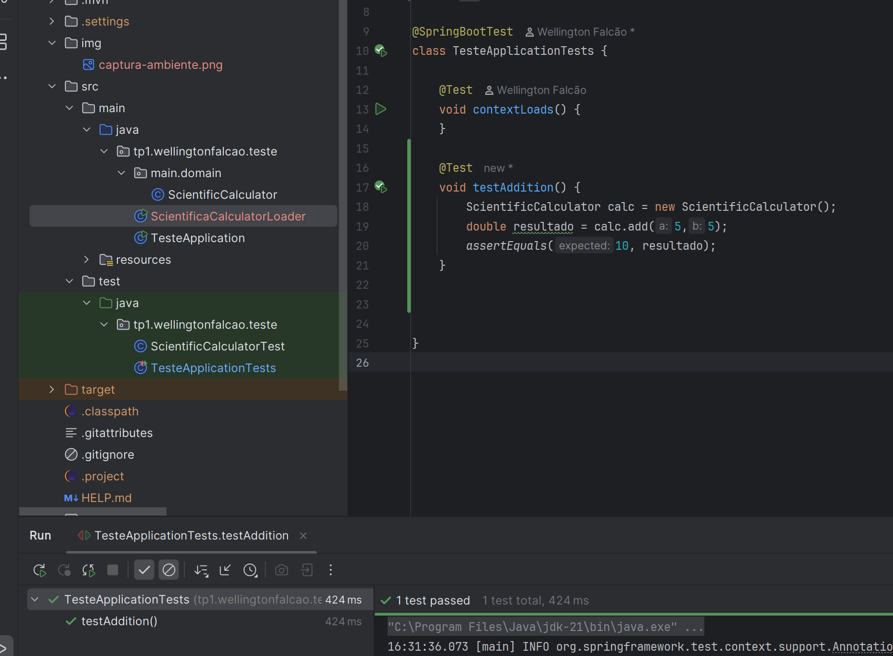

# TP1 – Testes Unitários com JUnit 5

## Índice
1. [Configurando o ambiente de testes](#1-configurando-o-ambiente-de-testes)
2. [Escrevendo o primeiro teste](#2-escrevendo-o-primeiro-teste)
3. [Aplicando as 4 fases de um teste](#3-aplicando-as-4-fases-de-um-teste)
4. [Test Fixture com @BeforeEach](#4-test-fixture-com-beforeeach)
5. [Testando um cenário de sucesso (Happy Path)](#5-testando-um-cenário-de-sucesso-happy-path)
6. [Testando um cenário patológico (Corner Case)](#6-testando-um-cenário-patológico-corner-case)
7. [Cenário de exceção (Divisão por zero)](#7-cenário-de-exceção-divisão-por-zero)
8. [Combinando múltiplas entradas (log e seno)](#8-combinando-múltiplas-entradas-log-e-seno)
9. [Priorizando testes com base na cobertura e comportamento](#9-priorizando-testes-com-base-na-cobertura-e-comportamento)
10. [Nomeando testes de forma adequada](#10-nomeando-testes-de-forma-adequada)
11. [Organizando os testes por comportamento](#11-organizando-os-testes-por-comportamento)

---

## 1. Configurando o ambiente de testes
- Criar projeto Java no IntelliJ IDEA.
- Adicionar dependência do JUnit 5 no `pom.xml` (Maven) ou `build.gradle` (Gradle).
- Configurar o projeto para executar testes unitários.

**Tarefa:**  
Tirar um print do ambiente configurado.

---

## 2. Escrevendo o primeiro teste
- Implementar teste `testAddition` para verificar se o método `add` retorna corretamente a soma de dois números.
- Executar o teste.

**Respostas:**
- **Painel de execução:** Exibe resultados dos testes (passou/falhou) com tempo de execução.
- **Código do teste:** *(inserir código aqui)*
- **Print do resultado:** *(inserir imagem aqui)*
- **Significado dos ícones e mensagens:**
  - ✔️ Verde: teste passou.
  - ❌ Vermelho: teste falhou.
  - Mensagens indicam qual teste foi executado e o resultado esperado/obtido.

**Resumo:**  
Fiz o teste do método `add()` da classe `ScientificCalculator`.  
Na classe `ScientificCalculatorTest`, criei o método `testeAddition()` com `@Test`, instanciei `calc` e usei `assertEquals` para comparar o valor esperado com o obtido.  
O teste passou com sucesso.

---

## 3. Aplicando as 4 fases de um teste
Criar teste para o método `subtract` utilizando:
- **Setup**
- **Execution**
- **Assertion**
- **Teardown** (se aplicável)

No código, comentar onde cada fase está localizada.

---

## 4. Test Fixture com @BeforeEach
- Implementar método anotado com `@BeforeEach` para instanciar `ScientificCalculator` antes de cada teste.
- Mostrar que o mesmo objeto é reaproveitado entre diferentes métodos de teste.

---

## 5. Testando um cenário de sucesso (Happy Path)
Implementar `testSquareRootPositive` para verificar se o cálculo da raiz quadrada de um número positivo está correto.

---

## 6. Testando um cenário patológico (Corner Case)
Implementar `testSquareRootNegative` para verificar se `squareRoot` lança exceção ao receber número negativo.  
Usar `assertThrows`.

---

## 7. Cenário de exceção (Divisão por zero)
Implementar `testDivideByZero` para verificar se `divide` lança `IllegalArgumentException` ao tentar dividir por zero.

---

## 8. Combinando múltiplas entradas (log e seno)
Implementar testes para métodos `log` e `sin`, garantindo precisão para valores positivos comuns.

---

## 9. Priorizando testes com base na cobertura e comportamento
**Quais métodos merecem mais atenção?**
- `divide`, `squareRoot` e `log` → possuem casos de exceção além dos casos válidos.

**Como a cobertura ajuda?**
- Mostra quais linhas e ramos condicionais foram executados.
- Indica trechos não testados (por exemplo, exceções não disparadas).
- Orienta a criar testes adicionais para cobrir lacunas.

---

## 10. Nomeando testes de forma adequada
- Revisar nomes de todos os testes criados.
- Renomear para seguir boas práticas (clareza e expressividade).

**Exemplos:**
- `test1` → `shouldReturnSumWhenAddingTwoPositiveNumbers`
- `rootTest` → `shouldThrowExceptionWhenSquareRootIsNegative`

---

## 11. Organizando os testes por comportamento
- Criar classe `ScientificCalculatorTest`.
- Agrupar testes semelhantes com:
  - Comentários
  - Métodos auxiliares

---
